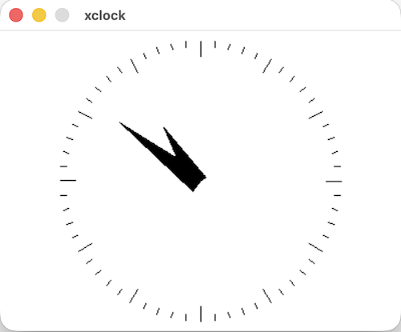

# XinkClock
### An xclock clone for e-ink displays

#### SDL Renderer
Includes an SDL renderer for more iterative development cycles.  

To compile the SDL renderer on desktop
```
cd desktop
make
./xclock
```


*SDL XinkClock on macOS*
